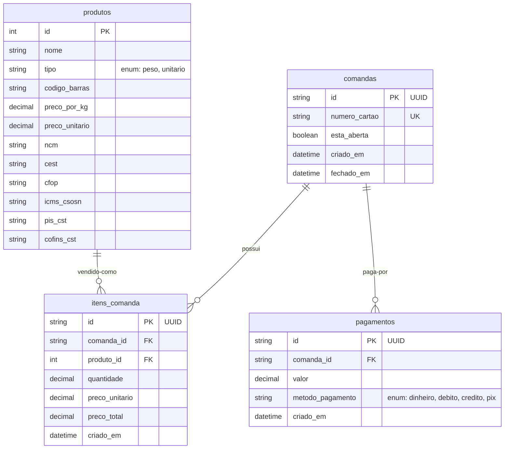

# Documentação da Modelagem do Banco de Dados

Este documento descreve o funcionamento, a estrutura e a lógica por trás da modelagem dos bancos de dados do **Sistema de Restaurante a Kilo**. O sistema utiliza uma arquitetura híbrida de banco de dados para garantir eficiência transacional e flexibilidade de auditoria.

---

## 1. Arquitetura Híbrida de Banco de Dados

Para atender aos diferentes requisitos do sistema (vendas fiscais rápidas e logs de hardware em tempo real), dividimos a persistência em dois tipos de bancos:

1. **MySQL (Banco Relacional / Transacional)**:
   * **Objetivo**: Garantir a integridade, consistência e segurança dos dados financeiros e cadastros (comandas, itens, produtos e pagamentos).
   * **Por que relacional?** Toda transação financeira (venda, baixa de comanda, emissão de nota) exige alta integridade transacional (garantia ACID) e relacionamentos rígidos (chaves estrangeiras) para evitar erros de caixa.

2. **MongoDB (Banco NoSQL / Documental)**:
   * **Objetivo**: Armazenar os logs de acesso das catracas em tempo real e auditoria geral de dispositivos.
   * **Por que NoSQL?** Comunicações de rede com catracas geram um alto volume de eventos rápidos (ex: tentativas de entrada, erros de leitura, cartões inválidos). O MongoDB possui altíssima velocidade de escrita e permite um esquema dinâmico (flexível), útil caso o restaurante decida trocar ou mesclar marcas de catracas com protocolos diferentes.

---

## 2. Estrutura do MySQL (Banco Relacional)

O diagrama abaixo ilustra o relacionamento das tabelas no MySQL:



### Dicionário de Tabelas e Campos

#### A. Tabela `produtos`
Cadastra tudo o que é vendido no restaurante (bebidas, buffet, sobremesas).
* `id`: Chave primária auto-incremental.
* `nome`: Nome amigável do produto (ex: "Coca-Cola 350ml", "Buffet Livre/Kg").
* `tipo`: Define a natureza da cobrança (`peso` para itens vendidos na balança ou `unitario` para itens fixos).
* `codigo_barras`: EAN/Código de barras (essencial para leitura rápida de bebidas no caixa).
* `preco_por_kg` / `preco_unitario`: Valores aplicados conforme o `tipo` do produto.
* **Campos Fiscais (NFC-e / SAT)**:
  * `ncm`: Classificação fiscal mercosul obrigatória (ex: refrigerantes `22021000`).
  * `cest`: Identificador de substituição tributária (usado principalmente em bebidas).
  * `cfop`: Código fiscal de operação (ex: `5101` para buffet preparado ou `5102` para revendas).
  * `icms_csosn`: Situação tributária do ICMS (ex: `500` para substituição tributária no Simples Nacional).
  * `pis_cst` / `cofins_cst`: Situações fiscais federais.

#### B. Tabela `comandas`
Representa os cartões físicos com código de barras ou RFID entregues aos clientes na entrada.
* `id`: Identificador único (UUID v4) para evitar adivinhação.
* `numero_cartao`: O número físico impresso na comanda (ex: `0012`). É único e indexado para buscas instantâneas.
* `esta_aberta`: Controle de status (`true` = cliente consumindo; `false` = comanda paga e liberada na catraca de saída).
* `criado_em` / `fechado_em`: Horários de abertura e encerramento para cálculo de tempo de permanência.

#### C. Tabela `itens_comanda`
O consumo do cliente. Cada vez que ele pesa o prato ou compra uma bebida, um item é registrado.
* `id`: UUID único do registro de consumo.
* `comanda_id`: Chave estrangeira ligando à comanda ativa. **Configurada com `ON DELETE CASCADE`** (se deletar a comanda, seus itens somem em cascata para evitar registros órfãos).
* `produto_id`: Chave estrangeira apontando para o produto cadastrado.
* `quantidade`: Campo numérico preciso (até 3 casas decimais) para suportar tanto o peso em quilos (ex: `0.455` kg) quanto quantidades unitárias (ex: `2.000` latas).
* `preco_unitario`: O preço unitário do produto **no momento da venda** (evita divergências se o preço mudar posteriormente).
* `preco_total`: Valor final calculado (`quantidade * preco_unitario`).

#### D. Tabela `pagamentos`
Registros de pagamentos efetuados no caixa antes da saída.
* `id`: UUID único do pagamento.
* `comanda_id`: Chave estrangeira ligando à comanda. **Configurada com `ON DELETE CASCADE`**.
* `valor`: Quantia paga.
* `metodo_pagamento`: Dinheiro, débito, crédito ou PIX.

---

## 3. Estrutura do MongoDB (Logs de Acesso da Catraca)

Para a catraca de entrada/saída (ex: Henry), usaremos o MongoDB. Cada tentativa de passagem gera um documento na coleção `logs_acesso`.

### Exemplo de Documento BSON/JSON:

```json
{
  "_id": "64bfa1e9f1a23b4c5d6e7f8a",
  "numero_cartao": "00123",
  "tipo_evento": "saida_bloqueada",
  "motivo": "comanda possui saldo devedor de R$ 43.46",
  "timestamp": "2026-07-22T10:19:03.123Z",
  "detalhes_dispositivo": {
    "catraca_id": "CAT-01",
    "ip": "192.168.1.50",
    "firmware": "v4.5"
  }
}
```

* **Vantagem**: Caso adicionemos novos sensores na catraca (ex: sensor óptico de presença, leitor biométrico facial), a tabela de logs não quebra, pois o MongoDB aceita novos campos em tempo real sem a necessidade de migrações (`ALTER TABLE`).

---

## 4. Fluxo Lógico de Caixa e Liberação de Catraca

1. **Entrada**: O cliente passa o cartão na catraca de entrada. A catraca envia o ID. O sistema cria um registro na tabela `comandas` com `esta_aberta = true`. O MongoDB registra: `tipo_evento: "entrada_autorizada"`. A catraca libera.
2. **Consumo**:
   * O cliente coloca o prato na balança. O sistema lê o peso (ex: `0.600` kg), calcula o preço base do produto buffet e grava na tabela `itens_comanda`.
   * O cliente pega bebidas. O caixa lê o código de barras, registra na tabela `itens_comanda`.
3. **Pagamento (Caixa)**:
   * O operador lê o cartão no caixa. O sistema soma os `itens_comanda` (ex: total R$ 50,00).
   * O cliente paga R$ 50,00 via PIX. O sistema grava em `pagamentos` e recalcula o saldo devedor.
   * Como o saldo devedor chegou a zero, a comanda é fechada (`esta_aberta = false` e define `fechado_em`).
4. **Saída**: O cliente insere ou lê o cartão na catraca de saída. A catraca consulta a API do sistema:
   * Se a comanda com aquele número de cartão estiver com `esta_aberta = false` (paga), o sistema envia sinal de liberação e grava log `saida_autorizada`.
   * Se ainda estiver com `esta_aberta = true`, a catraca exibe "Comanda não paga" no visor, mantém o braço travado e grava log `saida_bloqueada` com o motivo do bloqueio no MongoDB.
